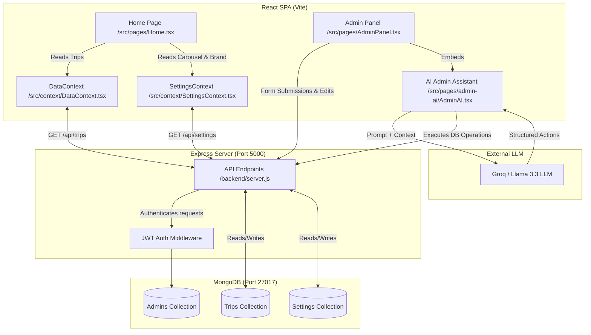

**# Zyro Travels - Project Architecture & Administration Guide

Welcome to the **Zyro Travels** documentation. This guide details the system architecture, component relationships, data flow, and how the **Home Page**, **Admin Panel**, and **AI Admin Assistant** interact with the backend database.

---

## 🗺️ System Architecture Diagram

This diagram shows how the frontend pages and contexts connect to the backend APIs, the MongoDB database, and the external AI service (Groq LLM):



---

## 🔗 Component Relationships

### 1. Home Page (`src/pages/Home.tsx`)
The customer-facing landing page of Zyro Travels.
* **Connections**: 
  * Reads the list of available trips from the **DataContext**.
  * Reads site metadata, brand title, and the **Hero Carousel Slide Configs** (titles, prices, images, descriptions) from the **SettingsContext**.
* **Visual Elements**:
  * **Hero Section**: Shows a 3-slide carousel loaded dynamically from settings.
  * **Featured Packages**: Renders trip cards loaded dynamically from the database.
  * **WhatsApp Floating Button**: Enables customers to chat directly with support.

### 2. Admin Panel (`src/pages/AdminPanel.tsx`)
The secure backend dashboard located at `/admin` where administrators manage content.
* **Authentication**: Login and Sign Up views. Generates a JWT token stored in `sessionStorage`.
* **Sub-Sections**:
  * **Content Manager**: Displays database metrics (Total Trips, Average Price, etc.), lists all packages, displays a live preview card, and features a manual creation/editing form.
  * **Site Settings**: Contains fields to update global variables (site title, contact phone/email) and the title, subtitle, descriptions, pricing, and images for all 3 Hero Carousel slides.
  * **Admin Profile**: Displays information about logged-in administrators and active admins list.
  * **AI Assistant**: Hosts the natural-language interface.

### 3. AI Admin Assistant (`src/pages/admin-ai/AdminAI.tsx`)
A conversational assistant that allows you to manage the website using plain English.
* **Language Model Integration**: Connects to the chat model service (via Groq/Llama-3.3-70b-versatile).
* **Contextual Parsing**:
  * Gathers current settings and trip names as context.
  * Translates commands like *"Change the contact phone to +91 99999 12345 and add a trip to Shimla for ₹12,000"* into structured database actions.
  * Automatically applies fallback placeholder images if a new trip is created without one.
* **Console Logs**: Displays API execution logs in real-time.

---

## ⚙️ Administrative Controls: What Can and Cannot Be Controlled

Here is a breakdown of what the Admin Panel can control in the application vs what requires direct code changes:

| Category | Can Control (via Form or AI Assistant) | Cannot Control (Requires Code Changes) |
| :--- | :--- | :--- |
| **Trip Packages** | <ul><li>Create, update, and delete trip packages</li><li>Set custom or predefined images</li><li>Configure titles, prices, durations, and start cities</li><li>Add/edit trip inclusions and exclusions</li></ul> | <ul><li>Modifying Mongoose validation rules</li><li>Changing the maximum duration field constraints</li></ul> |
| **Carousel & Hero** | <ul><li>Swap images for all 3 slides</li><li>Edit slide titles, subtitles, and descriptions</li><li>Set pricing tags shown on the carousel slides</li></ul> | <ul><li>Adding a 4th slide to the carousel</li><li>Modifying slide transition durations or animations</li></ul> |
| **Global Branding** | <ul><li>Update website title/brand name</li><li>Modify support phone number and contact email</li></ul> | <ul><li>Changing the website's logo file (`logo.png`)</li><li>Altering main color schemes (`--primary` red, etc.)</li></ul> |
| **Admin Accounts** | <ul><li>Register new administrators</li><li>View active administrator logs</li></ul> | <ul><li>Changing password hashing algorithms</li><li>Altering JWT token expiration durations (12 hours)</li></ul> |

---

## 🚀 Getting Started & Running Locally

### Prerequisites
* **Node.js** installed on your system.
* **MongoDB** server running locally (`mongodb://localhost:27017`).

### Steps to Run
1. **Install Frontend Dependencies**:
   ```bash
   npm install
   ```
2. **Install Backend Dependencies**:
   ```bash
   cd backend
   npm install
   cd ..
   ```
3. **Seed the Database**:
   Seeding populates initial settings, trips, and creates a default administrator account (`admin@zyrotravels.com` / `admin123`):
   ```bash
   node backend/seed.js
   ```
4. **Start the Servers**:
   * **Backend** (Express): Run `node backend/server.js` (runs on port `5000`).
   * **Frontend** (Vite): Run `npm run dev` (runs on port `5173`).
**
