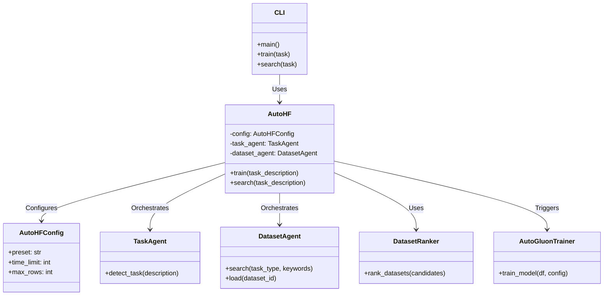

**# Zyro Travels - Project Architecture & Administration Guide

Welcome to the **Zyro Travels** documentation. This guide details the system architecture, component relationships, data flow, and how the **Home Page**, **Admin Panel**, and **AI Admin Assistant** interact with the backend database.

---

## 🗺️ System Architecture Diagram

This diagram shows how the frontend pages and contexts connect to the backend APIs, the MongoDB database, and the external AI service (Groq LLM):

```mermaid
graph # 🚀 AutoHF

**One-line AutoML: from idea to trained model using Hugging Face + AutoGluon.**

AutoHF is an autonomous machine learning pipeline that takes a natural language description of a task (e.g., "sentiment analysis") and automatically finds the best datasets on Hugging Face, ranks them by quality, and trains a state-of-the-art model using AutoGluon.

---

## ✨ Features

- **🔍 Intent-to-Task:** Automatically detects ML task types (classification, regression, etc.) and keywords from natural language.
- **📦 Autonomous Dataset Discovery:** Searches the Hugging Face Hub for relevant datasets using multi-strategy search.
- **🏆 Intelligent Ranking:** Ranks datasets based on quality signals like downloads, likes, and metadata completeness.
- **🏋️ Automated Training:** Leverages AutoGluon to train high-quality models with minimal configuration.
- **🧬 Agentic Architecture:** Inspired by patterns from **AutoGen**, **LangGraph**, and **OpenHands** for robust state management and collaboration.

---

## 🛠️ Internal Workflow

The following diagram shows how AutoHF orchestrates the pipeline from user input to a trained model:

```mermaid
graph TD
    User([User Input: 'sentiment analysis']) --> CLI[CLI / Python API]
    CLI --> Orchestrator[AutoHF Orchestrator]
    
    subgraph "Autonomous Pipeline (LangGraph-inspired States)"
        Orchestrator --> State1[Detecting Task]
        State1 --> TaskAgent[TaskAgent: Detects task type & keywords]
        
        TaskAgent --> State2[Searching Datasets]
        State2 --> DatasetAgent[DatasetAgent: Searches HF Hub]
        
        DatasetAgent --> State3[Ranking Datasets]
        State3 --> Ranker[DatasetRanker: Ranks by quality signals]
        
        Ranker --> State4[Loading & Profiling]
        State4 --> Loader[DatasetAgent: Loads best candidate & profiles]
        
        Loader --> State5[Training]
        State5 --> Trainer[AutoGluonTrainer: Trains & Optimizes]
    end
    
    Trainer --> State6[Completed]
    State6 --> Result[TrainResult: Model + Metrics]
    Result --> User
```

## 🏗️ Project Structure

The following diagram illustrates the static architecture and relationship between modules:



---

## 🚀 Quick Start

### Installation

```bash
# Basic installation
pip install autohf

# With training support (recommended)
pip install "autohf[train]"
```

### CLI Usage

Train a model with a single command:

```bash
# Quick prototype
autohf train "sentiment analysis"

# Higher quality training
autohf train "spam detection" --preset high_quality

# Just search for datasets
autohf search "question answering" --models
```

### Python API

```python
from autohf import AutoHF

# Initialize and train
hf = AutoHF.from_preset("medium_quality")
result = hf.train("customer review classification")

# Access results
print(f"Best model: {result.best_model_name}")
print(f"Accuracy: {result.metrics['accuracy']}")
print(f"Model saved at: {result.model_path}")
```

---

## 📋 Presets

AutoHF provides several presets inspired by AutoGluon to balance speed and quality:

| Preset | Time Limit | Focus |
| :--- | :--- | :--- |
| `quick_prototype` | 60s | Fast iteration, small datasets |
| `medium_quality` | 300s | **Default** - Good balance of speed/quality |
| `high_quality` | 600s | Better results, longer training |
| `best_quality` | 3600s | Maximum performance |
| `optimize_for_deployment` | 300s | Small model size, fast inference |

---

## 🏗️ Architecture & Patterns

AutoHF is built using modern software engineering patterns for AI:

- **State Management:** Uses a typed state machine (via `PipelineState`) inspired by **LangGraph** to track progress and handle transitions.
- **Agent Collaboration:** Employs specialized agents (**TaskAgent**, **DatasetAgent**) similar to **AutoGen** to separate concerns.
- **Autonomous Execution:** Implements retry logic and multi-strategy discovery patterns found in **OpenHands**.
- **Tabular Power:** Uses **AutoGluon** as the underlying engine for robust, automated model selection and hyperparameter tuning.

---

## 🗺️ Project Roadmap

Here is the planned development roadmap for AutoHF. Contributions and suggestions are welcome!

### Phase 1: Core Pipeline (Completed / In Progress)
- [x] Intent-to-Task detection with keyword extraction
- [x] Autonomous Hugging Face dataset search with multi-strategy discovery
- [x] Intelligent dataset ranking (downloads, likes, metadata)
- [x] AutoGluon-based automated training integration
- [x] CLI and Python API entry points
- [x] Configuration presets (quick/medium/high/best quality)
- [x] Agentic architecture with TaskAgent, DatasetAgent, and DatasetRanker

### Phase 2: Enhanced Model Hub
- [ ] Support for custom model fine-tuning (beyond AutoGluon tabular models)
- [ ] Integration with Hugging Face Model Hub for downloading pre-trained models
- [ ] Multi-modal support (image, audio, text classification)
- [ ] Model versioning and experiment tracking

### Phase 3: Advanced Dataset Management
- [ ] Dataset quality validation (missing values, class imbalance detection)
- [ ] Automatic dataset cleaning and preprocessing recommendations
- [ ] Train/validation/test split optimization
- [ ] Dataset caching and local mirror support

### Phase 4: Deployment & Serving
- [ ] Model export to ONNX, TorchScript, and CoreML formats
- [ ] REST API serving with FastAPI
- [ ] Docker containerization for easy deployment
- [ ] Batch prediction pipelines

### Phase 5: Observability & Collaboration
- [ ] Training metrics dashboard
- [ ] Pipeline execution logs and audit trails
- [ ] Team collaboration features (shared datasets, model registry)
- [ ] CI/CD integration for model retraining

### Phase 6: Enterprise Features
- [ ] Private Hugging Face Hub / AWS S3 / Azure Blob Storage support
- [ ] Role-based access control (RBAC)
- [ ] Scalable distributed training support
- [ ] Compliance and governance tooling

---

## 📜 License

MIT License. See `LICENSE` for details.

  subgraph Frontend ["React SPA (Vite)"]
    H["Home Page /src/pages/Home.tsx"]
    A["Admin Panel /src/pages/AdminPanel.tsx"]
    AI["AI Admin Assistant /src/pages/admin-ai/AdminAI.tsx"]
    DC["DataContext /src/context/DataContext.tsx"]
    SC["SettingsContext /src/context/SettingsContext.tsx"]
  end

  subgraph LLM_Service ["External LLM"]
    LLM["Groq / Llama 3.3 LLM"]
  end

  subgraph Backend ["Express Server (Port 5000)"]
    API["API Endpoints /backend/server.js"]
    Auth["JWT Auth Middleware"]
  end

  subgraph Database ["MongoDB (Port 27017)"]
    D_Trips[("Trips Collection")]
    D_Settings[("Settings Collection")]
    D_Admins[("Admins Collection")]
  end

  %% Frontend Data Flows
  H -->|Reads Trips| DC
  H -->|Reads Carousel & Brand| SC
  
  A -->|Form Submissions & Edits| API
  A -->|Embeds| AI
  
  AI -->|Prompt + Context| LLM
  LLM -->|Structured Actions| AI
  AI -->|Executes DB Operations| API
  
  DC <-->|GET /api/trips| API
  SC <-->|GET /api/settings| API
  
  %% Backend Operations
  API -->|Authenticates requests| Auth
  Auth --> D_Admins
  
  API <-->|Reads/Writes| D_Trips
  API <-->|Reads/Writes| D_Settings
```

---

## 🔗 Component Relationships

### 1. Home Page (`src/pages/Home.tsx`)
The customer-facing landing page of Zyro Travels.
* **Connections**: 
  * Reads the list of available trips from the **DataContext**.
  * Reads site metadata, brand title, and the **Hero Carousel Slide Configs** (titles, prices, images, descriptions) from the **SettingsContext**.
* **Visual Elements**:
  * **Hero Section**: Shows a 3-slide carousel loaded dynamically from settings.
  * **Featured Packages**: Renders trip cards loaded dynamically from the database.
  * **WhatsApp Floating Button**: Enables customers to chat directly with support.

### 2. Admin Panel (`src/pages/AdminPanel.tsx`)
The secure backend dashboard located at `/admin` where administrators manage content.
* **Authentication**: Login and Sign Up views. Generates a JWT token stored in `sessionStorage`.
* **Sub-Sections**:
  * **Content Manager**: Displays database metrics (Total Trips, Average Price, etc.), lists all packages, displays a live preview card, and features a manual creation/editing form.
  * **Site Settings**: Contains fields to update global variables (site title, contact phone/email) and the title, subtitle, descriptions, pricing, and images for all 3 Hero Carousel slides.
  * **Admin Profile**: Displays information about logged-in administrators and active admins list.
  * **AI Assistant**: Hosts the natural-language interface.

### 3. AI Admin Assistant (`src/pages/admin-ai/AdminAI.tsx`)
A conversational assistant that allows you to manage the website using plain English.
* **Language Model Integration**: Connects to the chat model service (via Groq/Llama-3.3-70b-versatile).
* **Contextual Parsing**:
  * Gathers current settings and trip names as context.
  * Translates commands like *"Change the contact phone to +91 99999 12345 and add a trip to Shimla for ₹12,000"* into structured database actions.
  * Automatically applies fallback placeholder images if a new trip is created without one.
* **Console Logs**: Displays API execution logs in real-time.

---

## ⚙️ Administrative Controls: What Can and Cannot Be Controlled

Here is a breakdown of what the Admin Panel can control in the application vs what requires direct code changes:

| Category | Can Control (via Form or AI Assistant) | Cannot Control (Requires Code Changes) |
| :--- | :--- | :--- |
| **Trip Packages** | <ul><li>Create, update, and delete trip packages</li><li>Set custom or predefined images</li><li>Configure titles, prices, durations, and start cities</li><li>Add/edit trip inclusions and exclusions</li></ul> | <ul><li>Modifying Mongoose validation rules</li><li>Changing the maximum duration field constraints</li></ul> |
| **Carousel & Hero** | <ul><li>Swap images for all 3 slides</li><li>Edit slide titles, subtitles, and descriptions</li><li>Set pricing tags shown on the carousel slides</li></ul> | <ul><li>Adding a 4th slide to the carousel</li><li>Modifying slide transition durations or animations</li></ul> |
| **Global Branding** | <ul><li>Update website title/brand name</li><li>Modify support phone number and contact email</li></ul> | <ul><li>Changing the website's logo file (`logo.png`)</li><li>Altering main color schemes (`--primary` red, etc.)</li></ul> |
| **Admin Accounts** | <ul><li>Register new administrators</li><li>View active administrator logs</li></ul> | <ul><li>Changing password hashing algorithms</li><li>Altering JWT token expiration durations (12 hours)</li></ul> |

---

## 🚀 Getting Started & Running Locally

### Prerequisites
* **Node.js** installed on your system.
* **MongoDB** server running locally (`mongodb://localhost:27017`).

### Steps to Run
1. **Install Frontend Dependencies**:
   ```bash
   npm install
   ```
2. **Install Backend Dependencies**:
   ```bash
   cd backend
   npm install
   cd ..
   ```
3. **Seed the Database**:
   Seeding populates initial settings, trips, and creates a default administrator account (`admin@zyrotravels.com` / `admin123`):
   ```bash
   node backend/seed.js
   ```
4. **Start the Servers**:
   * **Backend** (Express): Run `node backend/server.js` (runs on port `5000`).
   * **Frontend** (Vite): Run `npm run dev` (runs on port `5173`).
**
